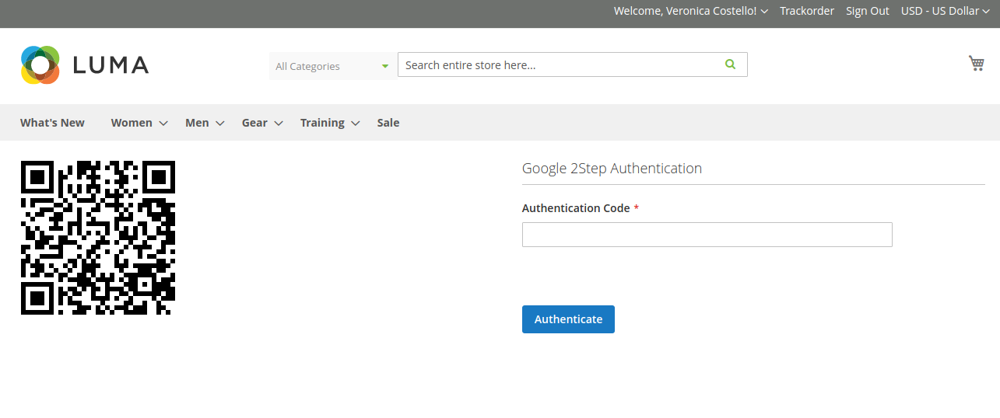

# Two Factor Authentication

Advanced Magento Two-Factor Authentication, which uses Google authenticator and your smart phone in order to authenticate your admin session

## Getting Started

Magento 2 Two-Factor Authentication will protect our Magento store from insecure Internet connections.

Every time we login there is a chance that someone is sniffing or logging the password, which can later be used to login to your store.

You can protect our store from these type of attacks by using our advanced Magento Two-Factor Authentication, which uses Google authenticator and your smart phone in order to authenticate your admin session.

### Prerequisites
[Google Authenticator App](https://play.google.com/store/apps/details?id=com.google.android.apps.authenticator2&hl=en)

### Installation

```
composer require landofcoder/module-authenticator
php bin/magento module:enable Lof_Authenticator
php bin/magento setup:upgrade
```

Please install & enable [Lof_Frontend2FA](https://github.com/landofcoder/module-frontend-2fa) for frontend 2FA.

```
composer require landofcoder/module-frontend-2fa
php bin/magento module:enable Lof_Frontend2FA
php bin/magento setup:upgrade
```

## Fun Demo
It authenticates only Admin Login however there is a frontend demo as well.

{Magento Store URL}/authenticator



## Authors

Landofcoder

## Donation

If this project help you reduce time to develop, you can give me a cup of coffee :) 

[](https://www.paypal.com/paypalme/allorderdesk)


**Our Magento 2 Extensions List**
* [Megamenu for Magento 2](https://landofcoder.com/magento-2-mega-menu-pro.html/)

* [Page Builder for Magento 2](https://landofcoder.com/magento-2-page-builder.html/)

* [Magento 2 Marketplace - Multi Vendor Extension](https://landofcoder.com/magento-2-marketplace-extension.html/)

* [Magento 2 Multi Vendor Mobile App Builder](https://landofcoder.com/magento-2-multi-vendor-mobile-app.html/)

* [Magento 2 Form Builder](https://landofcoder.com/magento-2-form-builder.html/)

* [Magento 2 Reward Points](https://landofcoder.com/magento-2-reward-points.html/)

* [Magento 2 Flash Sales - Private Sales](https://landofcoder.com/magento-2-flash-sale.html)

* [Magento 2 B2B Packages](https://landofcoder.com/magento-2-b2b-extension-package.html)

* [Magento 2 One Step Checkout](https://landofcoder.com/magento-2-one-step-checkout.html/)

* [Magento 2 Customer Membership](https://landofcoder.com/magento-2-membership-extension.html/)

* [Magento 2 Checkout Success Page](https://landofcoder.com/magento-2-checkout-success-page.html/)


**Featured Magento Services**

* [Customization Service](https://landofcoder.com/magento-2-create-online-store/)

* [Magento 2 Support Ticket Service](https://landofcoder.com/magento-support-ticket.html/)

* [Magento 2 Multi Vendor Development](https://landofcoder.com/magento-2-create-marketplace/)

* [Magento Website Maintenance Service](https://landofcoder.com/magento-2-customization-service/)

* [Magento Professional Installation Service](https://landofcoder.com/magento-2-installation-service.html)

* [Customization Service](https://landofcoder.com/magento-customization-service.html)


## License

This project is licensed under the MIT License
